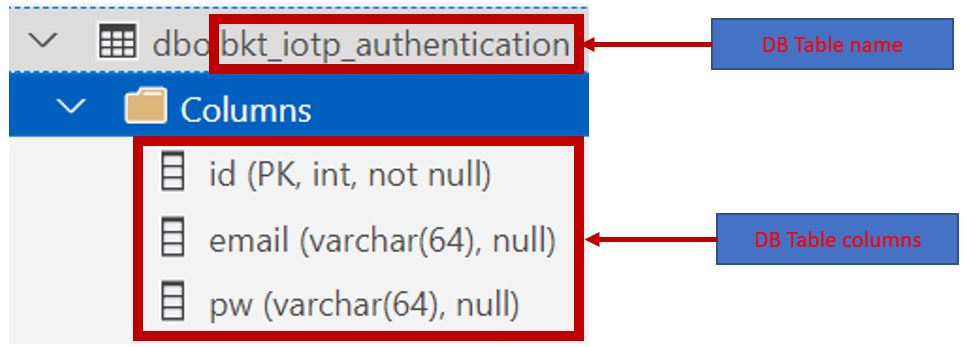

# Description
This documentation will walk you through the steps to get the project Android application up and running. The things needing change in the Android application program have been marked with the comment "*TO SUPPLY OWN INFORMATION HERE:*" in the project code. 
After going through this, it is strongly recommended that you go through [2_Program_Details.md](2_Program_Details.md) to get a better understanding of the appliation program and how it works.

# Pre-requisites
## For Azure SQL:
0. To have created Azure SQL Server, Database and Database table. Database table to have the 3 following columns: id (PRIMARY KEY), email (VARCHAR 64), pw (VARCHAR 64); 'email' and 'pw' column will be filled with hashed values of said column.

1. To have added the Android phone's (where the app will run on) public IP address into Azure SQL Server's whitelist firewall.

2. To have attained the Azure SQL Database's JDBC connection string.
 

## For AWS Simple Email Service (SES)
0. To have created an AWS account with SES configured and running.

1. To have validated the emails (both sender and recipient) in use for this application.

2. To have SMTP credentials in order for application program to work with AWS SES. Below are 2 methods if to obtain SMTP credentials.   
2.1. Method 1: Downloaded credentials at first creation of SMTP credentials. 
   
2.2. Method 2: Go to Amazon SES > SMTP settings > Create SMTP credentials. !Remember to save credentials this time round!  
   

3. To have host name (region) of SES.

## For ThingSpeak MQTT Broker
0. To have craeted Channel and Channel field. To also have ThingSpeak certificate (provided in '2_Program_details')

1. To have created ThingSpeak MQTT credentials for publisher.

1.1. If you have forgotten your password, you can regenerate it with the following steps:

# Next Up
[2_Program_Details.md](2_Program_Details.md)
