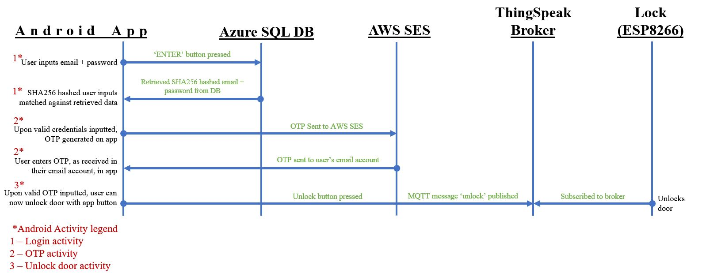
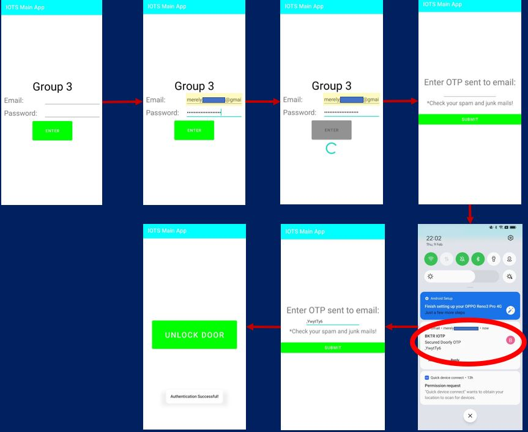

# Description </br>
The replacement for the need of a traditional key and shaft (key and lock), our Android application is the newest
and most mordern way to unlocking a door. The complete removal for the need of a key to unlock a door
amplifies convenience, accessibility and security. This application features 3 activities to bring this idea to life:
1. authentication_page: Where user log in with their email and complex passoword.
2. email_otp: Where user provide a second step authentication.
3. main: Where user get a clickable button to unlock the door.

## Sections covered: 
1. Things needed </br>
2. Application flow </br>
3. Application documentation </br>

# 1 - Things needed:
(Refer to [1_How_to_use.md](1_How_to_use.md))
1. Android phone with internet/cellular connectivity
2. AWS Simple Email Service (SES): For sending of generated OTP to respective user
3. Azure SQL Server + Database: For storing of hashed user credentials 
4. ThingSpeak MQTT broker: For communication with Arduino locking system

# 2 -  Application flow </br>
1. User-login credentials to be provided on start up of application. If credential(s)
is/are incorrect, generic error message will be shown. Login maximum attempt of 4 will decrement if credentials entered incorrectly and a 2 minute login lock-out will occur if the max attempts are used up. 

2. Upon successful login, user will receive an 8 digit OTP in the email they entered at login.
If OTP is entered wrongly thrice, user will be forced to re-login from login activity. 

3. After successful login and OTP authentication, user will then be brought to the main application page - A clickable button to unlock the door. 

4. Pressing of the button will unlock their respective/assigned door.  

With that knowledge in mind, this is the detailed application flow diagram:


Here is the UI flow of our app:


# 3 - Application documentation
## 3.1. - Accounts needed
### The accounts created to support this project will be:
1. An AWS SES account       [Free for students] </br>
2. Azure Server + Database  [Free for students] </br>
3. ThingSpeak MQTT Broker with credentials for publisher created </br>
The credentials of a ThingSpeak MQTT publisher should not be the same of that a ThingSpeak MQTT subscriber.

## 3.2. - Project prerequisites
### Files needed for project:
The following are the important files that need to be imported into your Android Studio /res/raw folder: 
</br>[Click here to download them](https://drive.google.com/drive/folders/1ylXdT9n1k2ODEw0C6G8MaT9ejocXsvMl?usp=sharing)</br>
```
1. javax.activation.jar   (Jar file to support AWS SES)
2. javax.additionnal.jar  (Jar file to support AWS SES)
3. javax.activation.jar   (Jar file to support AWS SES)
4. thingspeakcert.crt     (Certificate of ThingSpeak to enable TLS/SSL communication through App)
```

### User permissions needed for project:
The following are required to be added into the Android Studio's AndroidManifest.xml file:
```java
<uses-permission android:name="android.permission.INTERNET" />
<uses-permission android:name="android.permission.ACCESS_NETWORK_STATE" />
<uses-permission android:name="android.permission.ACCESS_WIFI_STATE" />
```

### Dependencies needed for project:
The following are the dependencies needed for the build.gradle file of your Android Studio project:
```java
dependencies {
    //Added dependencies:
    implementation 'org.eclipse.paho:org.eclipse.paho.client.mqttv3:1.0.2'      //For MQTT
    implementation 'org.eclipse.paho:org.eclipse.paho.android.service:1.0.2'    //For MQTT
    implementation 'org.eclipse.paho:org.eclipse.paho.client.mqttv3:1.2.5'      //For MQTT
    implementation files('libs\\jtds-1.3.1.jar')                                //For Azure SQL
    implementation files('libs\\javax.mail.jar')                                //For AWS SES
    implementation files('libs\\javax.activation.jar')                          //For AWS SES
    implementation files('libs\\javax.additionnal.jar')                         //For AWS SES
    implementation 'org.bouncycastle:bcpkix-jdk15on:1.70'                       //For ThingSpeak Certificate

    //Default ones:
    implementation 'androidx.appcompat:appcompat:1.3.1'
    implementation 'com.google.android.material:material:1.4.0'
    implementation 'androidx.constraintlayout:constraintlayout:2.0.4'
    testImplementation 'junit:junit:4.+'
    androidTestImplementation 'androidx.test.ext:junit:1.1.3'
    androidTestImplementation 'androidx.test.espresso:espresso-core:3.4.0'
}
```

## 3.3. - Activtiy 1: authentication_page
### This is the launcher activity of the application. Users will always have to login when application first loads up. Appropriate comments have been made in the program for a deeper understanding of the activity, however, the important functions and class of the activity will be:
```
1. byte[] getHash(String toHash): Getting hash of credentials to compare with ones stored in DB
2. String lockout(): Locks user out of inputting if max attempts reached
3. class CheckLogin: Retrieves already-hashed user credentials from Azure DB to validate hashed user-inputted credentials
```

## 3.4. - Activity 2: email_otp
### This is the activity where our application generates an OTP, then sends it to AWS SES, who will then send the OTP to the user email inputted at 'authentication_page' activity. The important functions and class of the activity will be:
```
1. String generateOTP(): Used to randomly generate (using the Random() java class) an 8 character long OTP; characters can be any character from the entirety of a conventional keybaord
2. void maxAttempts(): To kick users back to login ativity if max number of OTP input tries are reached
3. class AmazonSESSample: This Java class is imported to the project's Java files to enable sneding of OTP to AWS SES
```

## 3.5. - Activity 3: main
### This activity provides users the button UI to unlock their door. Upon the pressing of the button, the activity publishes an 'unlock' MQTT message to the ThingSpeak MQTT broker, that the lock (ESP8266) is subscribed to too. The important funtions of the activity will be:
```
1. void mqttclient(String door_action): Used to publish MQTT message securly to ThingSpeak MQTT broker throught the use of ThingSpeak's certificate
```

# Next Up
<a href = "/2. Arduino Code/3_How_smart_lock_works.md">3: How smart lock works</a>
