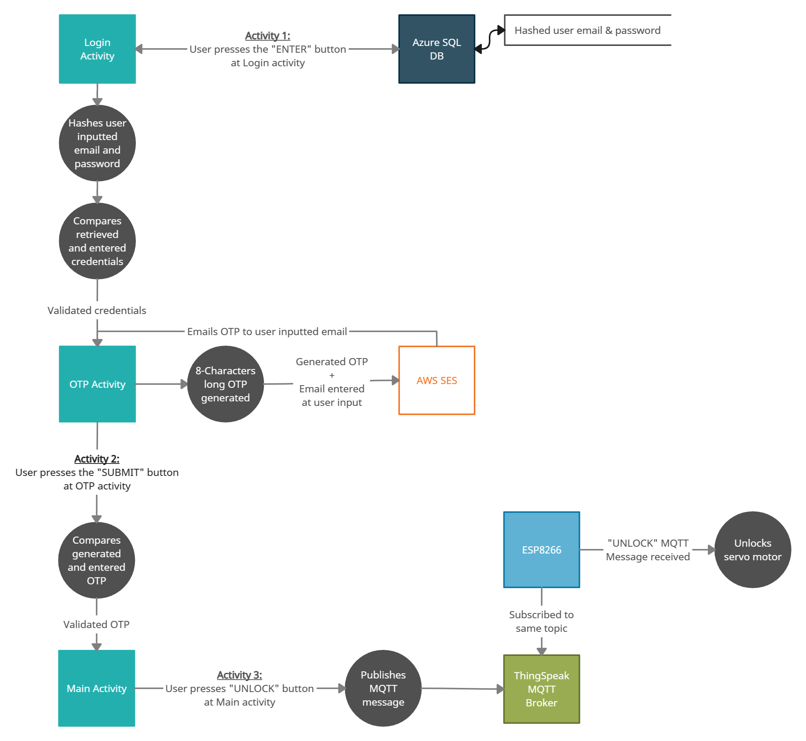
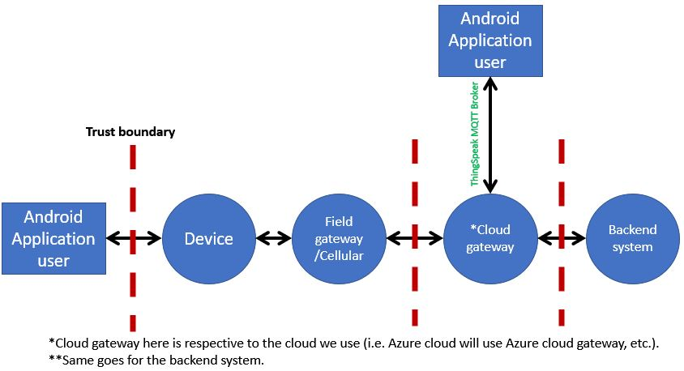
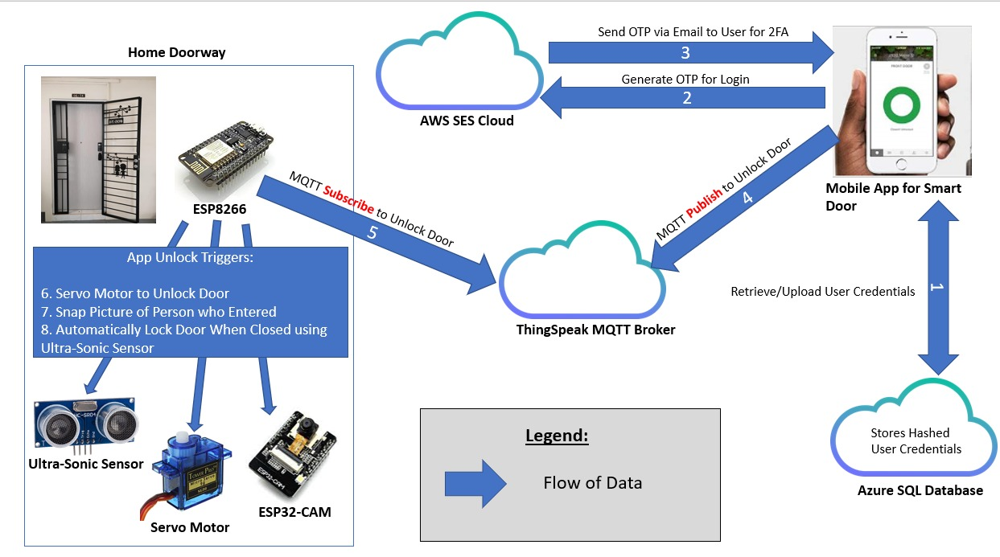
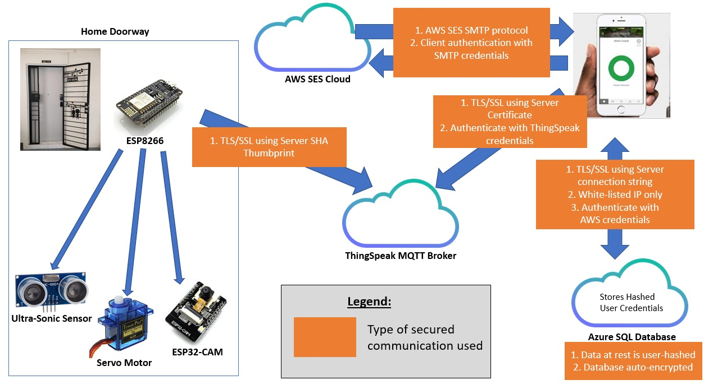
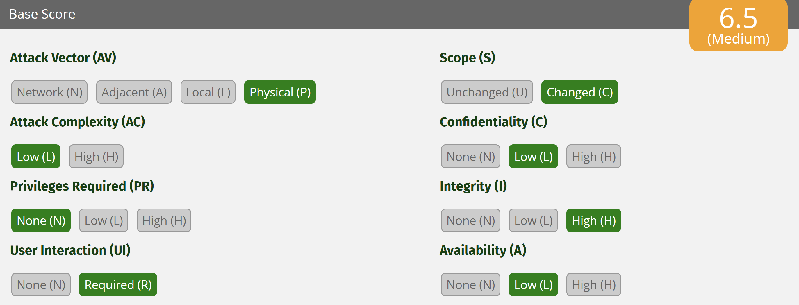
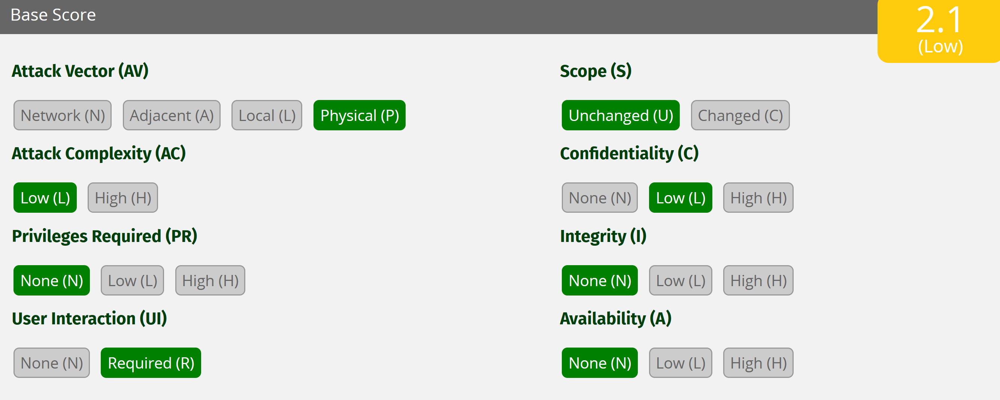
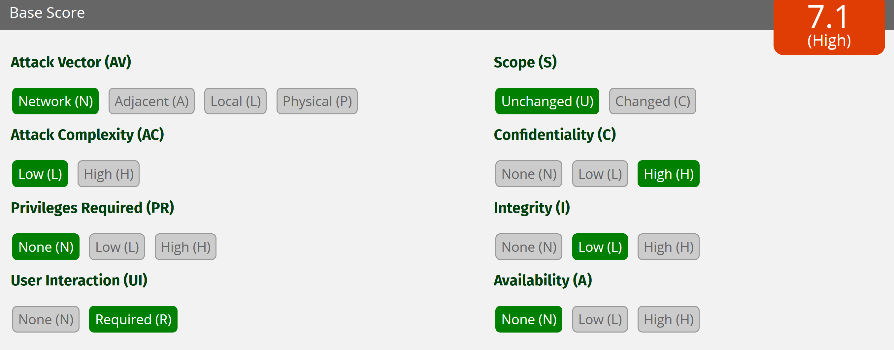
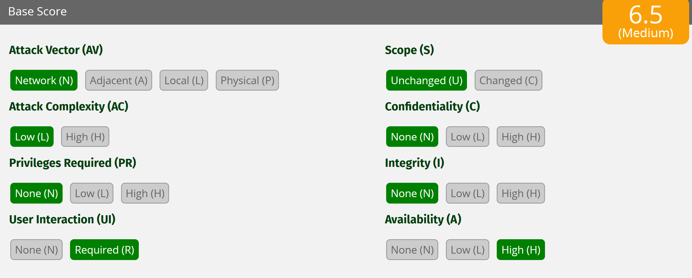
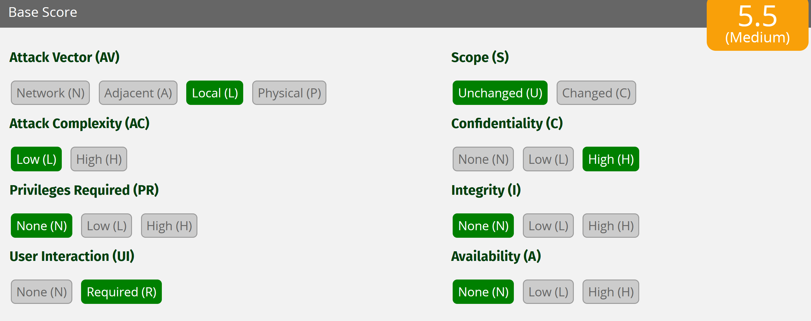
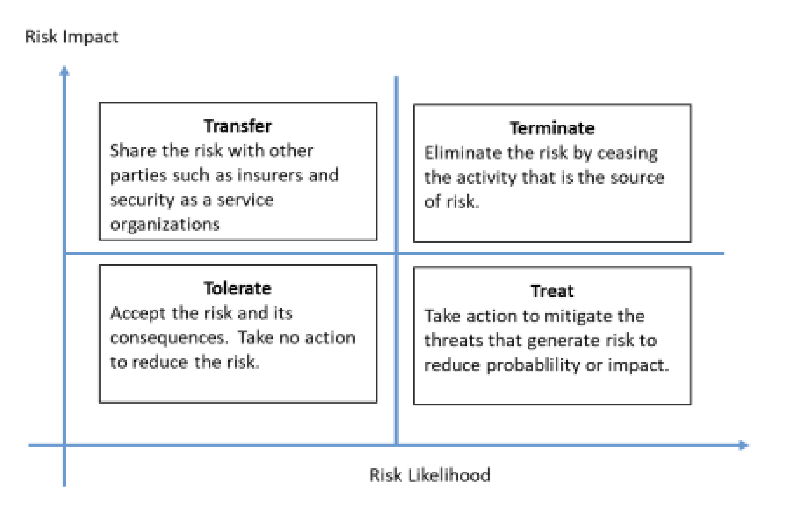

# Step 1: Identifying of Security Objectives
This project was initiated and created  to serve as a consumer technology. It was built to 
allow users to remotely, or conveniently, unlock their door, without going through the hassle of finding
and digging for their physical key.  

The security objective of this project is to ensure that data security is upheld from one end to the other for
a secured end-to-end door entry system. It is important that the user credentials (be it for the Android application or Cloud databases
used) are not leaked or stolen. The consequences of data theft would be severe to the smart lock user, as a threat actor will be able to:

1. Give themselves (or others) unauthorized access to a user's physical home: This will open their home up to theft and other possible losses that
will be of financial and emotional burden to the authorized user.
2. Deny the authorized user entry to their own home: This may give the authorized users a bad impression of the system and completely remove it from their home.

These consequences will be fatal to the company building the smart locks as customers may put out a bad name for them, leading to reputation and financial disaster
beyond damage control.

# Step 2: Documentation of IoT System Architecture
This is our data flow diagram of the system, using Yourdon and Coad symbols:

And these are the identified IoT Zone and Trust boundaries:

# Step 3: Decomposing of IoT System
This is a physical flow of how the system works:
 

While these are the secure communications used to support the data flow.

# Step 4: Identifying and Rating Threats

The DREAD model quantitatively assesses the severity of a cyberthreat using a scaled rating system that assigns numerical values to risk categories.
 The DREAD model has five categories:
- Damage: Potential damage a particular threat is capable of causing. (1-Low, 3-High)
- Reproducibility: How easy is it to replicate an attack. (1-Difficult, 3-Easy)
- Exploitability: How much work is it to launch an attack. (1-Little, 3-A lot)
- Affected Users: How many users would be affected by a cyberattack. (1-Little, 3-A lot)
- Discoverability: How easy it is for threat actors to find a threat. (1-Difficult, 3-Easy)

We have assessed the system before deployment and found the various threats and attacks.
Attack surface and threat|D|R|E|A|D|Total
--------------|-|-|-|-|-|-----------
Physical device - Device can be tampered with physically and injected with malicious code to gain access to the smart lock.|3|3|2|3|3|14
Physical device - Since the system runs on batteries, will run out or can be disconnected.|2|3|2|2|3|12 
Communications - Data remains unencrypted when transmitting to the SQL database making our data vulnerable to eavesdropping. Resulting in attackers to gain access to the user's email and password to gain access to the system.|3|3|2|3|3|14
Communications - Web service and SQL database recieving DoS attacks to flood our network and making it inaccessable for users.|3|3|1|3|3|13
Application - Brute force attack to gain access to smart lock app.|3|3|2|2|2|12

We then ran the Cyberthreats through a CVSS scoring system, to further assess the vulnerabilities of our system.

Physical device - Device can be tampered with physically and injected with malicious code to gain access to the smart lock.

Physical device - Since the system runs on batteries, will run out or can be disconnected.

Communications - Data remains unencrypted when transmitting to the SQL database making our data vulnerable to eavesdropping. Resulting in attackers to gain access to the user's email and password to gain access to the system.

Communications - Web service and SQL database recieving DoS attacks to flood our network and making it inaccessable for users.

Application - Brute force attack to gain access to smart lock app.

After assessing the severity of the various CyberThreats. We then judged the likelihood of such events occurring.
Attack surface and threat|Total|Likelihood
--------------|--------------|-----------
Physical device - Device can be tampered with physically and injected with malicious code to gain access to the smart lock.|14|2
Communications - Data remains unencrypted when transmitting to the SQL database making our data vulnerable to eavesdropping. Resulting in attackers to gain access to the user's email and password to gain access to the system |14|3
Communications - Web service and SQL database recieving DoS attacks to flood our network and making it inaccessable for users.|13|2
Physical device - Since the system runs on batteries, will run out or can be disconnected.|12|1 
Application - Brute force attack to gain access to smart lock app.|12|3

# Step 5: Recommending Mitigations

We then referred to the risk response chart below and handled the potential threats accordingly.

Attack surface and threat|Risk response|Mitigation Strategy
--------------|--------------|-----------
Physical device - Device can be tampered with physically and injected with malicious code to gain access to the smart lock.|Treat|We will secure our system with a case that ensures no attacker is able to access the system physically and tamper with our devices
Communications - Data remains unencrypted when transmitting to the SQL database making our data vulnerable to eavedroppng. Resulting in attackers to gain access to the user's email and password to gain access to the system |Transfer|We will be using Azure SQL as our database which enforces encryption at all times for all connections, both in transit and at rest
Communications - Web service and SQL database recieving DoS attacks to flood our network and making it inaccessible for users.|Transfer|We will be implementing AWS and Azure SQL which has built-in services to tackle such attacks such as AWS shield and DoSGuard respectively
Physical device - Since the system runs on batteries, will run out or can be disconnected.|Treat|regular system checkups and maintenance will be done to ensure the system is functioning and will not run out of battery 
Application - Brute force attack to gain access to smart lock app.|Treat| We have implemented a system lock-out for a suspicious amount of unauthorised attempts to login to the application

# Next Up:
<a href="/5. Security Testing/6_Security_testing.md">6. Security testing using Kali Linux</a>
