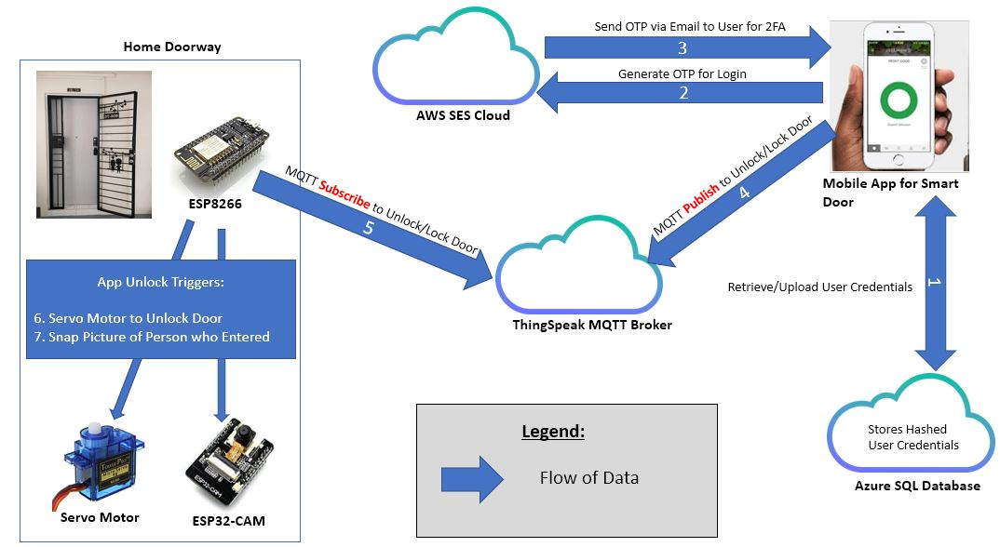
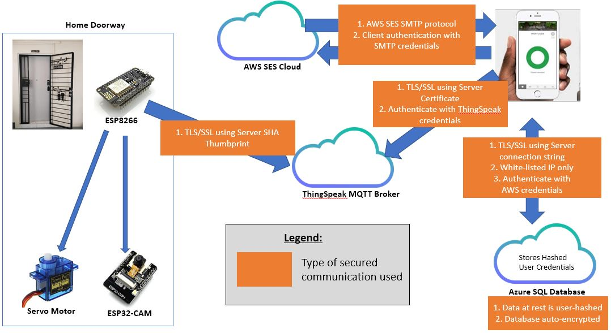

# Step 1: Identifying of Security Objectives
This project was initiated and created  to serve as a consumer technology. It was built to 
allow users to remotely, or conveniently, unlock their door, without going through the hassle of finding
and digging for their physical key.  

The security objective of this project is to ensure that data security is upheld from one end to the other for
a secured end-to-end door entry system. It is important that the user credentials (be it for the Android application or Cloud databases
used) are not leaked or stolen. The consequences of data theft would be severe to the smart lock user, as a threat actor will be able to:

1. Give themselves (or others) unauthorized access to a user's physical home: This will open their home up to theft and other possible losses that
will be of financial and emotional burden to the authorized user.
2. Deny the authorized user entry to their own home: This may give the authorized users a bad impression of the system and completely remove it from their home.

These consequences will be fatal to the company building the smart locks as customers may put out a bad name for them, leading to reputation and financial disaster
beyond damage control.

# Step 2: Documentation of IoT System Architecture
To start off the Architecture, this is a physical flow of how the system works.

Next, data flow diagram of the system using Yourdon and Coad symbols.

Finally, these are the secure communications used to support the data flow.

This is our IoT Zone and Trust boundaries
<Zone and Trust here>

# Step 3: Decomposing of IoT System
<Created ppt flows here>

# Step 4: Identifying and Rating Threats

# Step 5: Recommending Mitigations

# Next Up:
<a href="/5. Security Testing/6_Security_testing.md">6. Security testing using Kali Linux</a>
